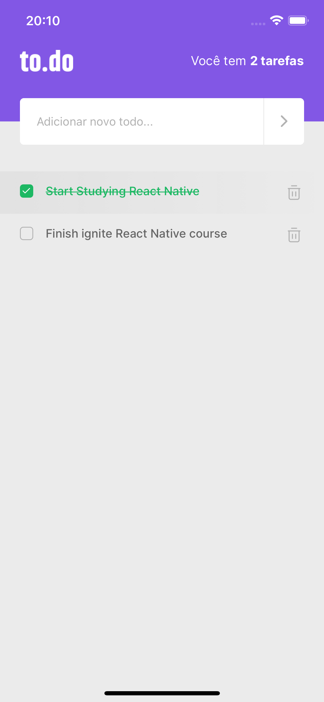

<div id="top"></div>

<br />
<div align="center">
  <h3 align="center">To.do</h3>

  <p align="center">
    An App to organize your stuffs!
    <br />
    <a href="https://github.com/brunomestanza/ignite-react-native"><strong>Explore the projects »</strong></a>
  </p>
</div>

<details>
  <summary>Table of Contents</summary>
  <ol>
    <li>
      <a href="#about-the-project">About The Project</a>
      <ul>
        <li><a href="#built-with">Built With</a></li>
      </ul>
    </li>
    <li><a href="#getting-started">Getting Started</a></li>
  </ol>
</details>

## About The Project
<div align="center">
  
</div>
<br/>
<p align="center">A simple App for a To.Do list.<p>
<p align="right">(<a href="#top">back to top</a>)</p>

### Built With

* [TypeScript](https://www.typescriptlang.org/)
* [React.js](https://reactjs.org/)
* [React Native](https://reactnative.dev/)

<p align="right">(<a href="#top">back to top</a>)</p>

## Getting Started

To get a local copy up and running follow these simple example steps.

```
$ git clone https://github.com/brunomestanza/ignite-react-native
$ cd ignite-react-native/todo/
$ yarn add
$ yarn run ios || yarn run android
```
